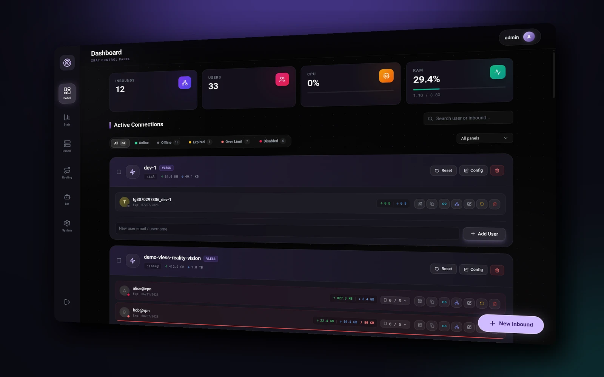
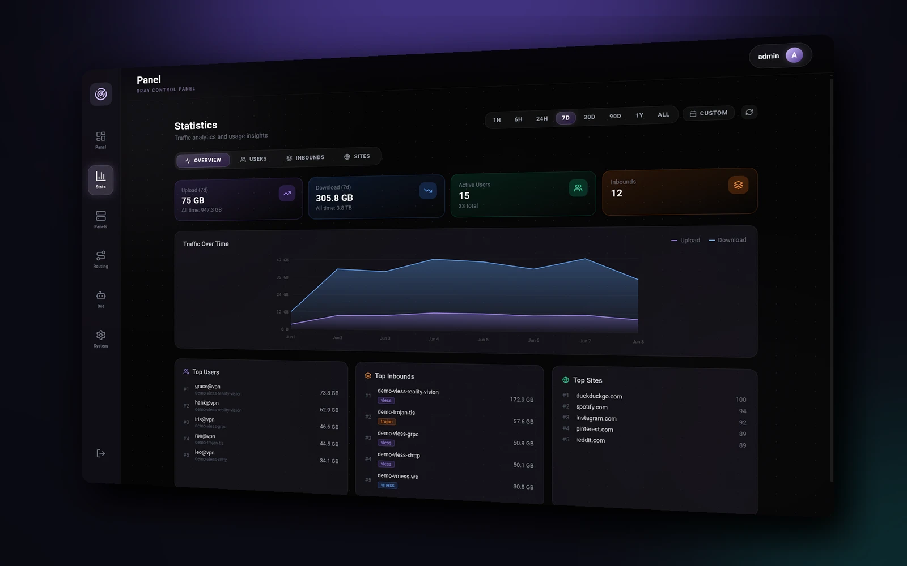
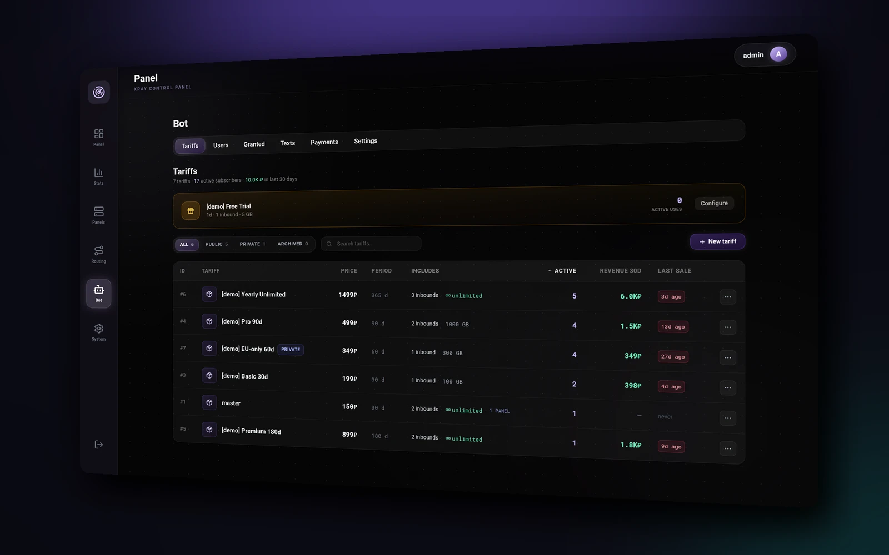
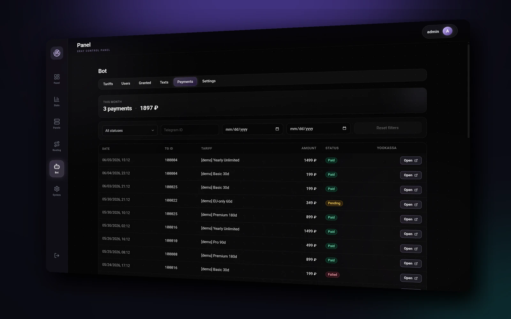

<div align="center">

# ITG Xray Panel

### A self-hosted [Xray-core](https://github.com/XTLS/Xray-core) manager — with a Telegram billing bot built in

Run a complete VPN service from one place: manage inbounds, users, traffic limits,
routing and live statistics from a modern web UI — and **sell, grant, or issue
subscriptions** straight inside Telegram, with YooKassa payments.

<br/>

[](https://github.com/IvanTopGaming/ITG_xray_panel/actions/workflows/ci.yml) [](LICENSE)      

<br/>

[**Quick Start**](#-quick-start) · [Features](#-features) · [Architecture](#-architecture) · [Configuration](#-configuration) · [Development](#-development)

</div>

---

## Why ITG Xray Panel

- **One stack, end to end** — proxy engine, admin panel, subscription delivery and a paid Telegram bot, wired together and deployed as one Docker Compose file per role.
- **Sell access without glue code** — tariffs, trials, grants, expiry/traffic notifications and YooKassa checkout are first-class, not bolted on.
- **Scales horizontally** — a master panel federates any number of nodes, routing users to specific regions; each role runs on its own host, so a node lives in an untrusted segment with a publish-only credential and no access to the shared database.
- **Built to hide** — the panel lives behind a secret URL, the public domain masquerades as a decoy site, and the Docker socket is locked down to the exact ops the backend needs.

> ⚠️ For lawful use only — run it on infrastructure you own and operate.

---

## 📸 Screenshots

<div align="center">

<br/>
<sub><b>Dashboard</b> — inbounds, users, live status &amp; per-user traffic</sub>

<br/><br/>

<br/>
<sub><b>Statistics</b> — traffic over time, top users &amp; sites</sub>

<br/><br/>

<br/>
<sub><b>Telegram bot</b> — tariffs &amp; plans</sub>

<br/><br/>

<br/>
<sub><b>Payments</b> — YooKassa billing history</sub>

</div>

---

## ✨ Features

### 🧩 Proxy panel

- **Every modern protocol** — VLESS (XTLS Vision · REALITY · TCP · WebSocket · gRPC · XHTTP · HTTPUpgrade), VMess, Trojan, Shadowsocks 2022, WireGuard, SOCKS5, HTTP. Vision flow is kept consistent with its transport automatically — only valid on raw-TCP + TLS/REALITY, and cleared from an inbound's users if you switch it to something incompatible.
- **Live user management** — add/edit users over Xray's gRPC API with no restart for VLESS/VMess; status at a glance (online · offline · expired · over-limit · disabled), last-seen and source-IP tracking, filtering and search.
- **Bulk actions** — select users across inbounds **and** linked panels, then delete / enable / disable / reset traffic / shift expiry / adjust the traffic cap / toggle Vision flow in one shot. Cross-panel batches are proxied to the owning panel and report any unreachable one without aborting the rest.
- **Traffic statistics** — hourly snapshots kept indefinitely, charts with period filtering (1h → all-time), top destination domains, per-panel breakdown.
- **Routing** — outbound servers, weighted balancers with fallback, per-user route overrides.
- **Dedicated egress IP** — send one client's traffic out through a rented secondary IP on the same host. A freedom outbound binds an internal source IP (`sendThrough`), a privileged sidecar keeps that IP aliased inside Xray's netns across restarts, and a panel-generated host script wires the public alias + a self-cleaning SNAT chain (+ policy routing). Assign it to a user with the existing per-user route override; the backend stays fully isolated and only serves the data.
- **Device limits** — optional per-client / per-inbound device cap with HWID-aware subscription delivery.

### 🤝 Subscriptions & Federation

- **Aggregated subscription link** — one URL returns the user's keys merged from the master and every linked panel, Redis-cached with a configurable refresh interval. The link is UUID-keyed, so renaming a user never breaks their app config.
- **Clean subscription domain** — serve subscriptions from a dedicated `SUB_DOMAIN` (e.g. `sub.example.com/...`) instead of the long secret-path URL.
- **Panel Federation** — one master manages any number of remote panels. Route a tariff item to a specific panel via `panel_id`, health-poll every linked panel, and authenticate both directions with a shared federation token.

### 💳 Telegram billing bot

- **YooKassa payments** — full checkout inside the chat. The unsigned webhook is only a trigger: the handler re-fetches the authoritative status from YooKassa before provisioning, backed by a 30-second poll fallback and atomic double-provision protection.
- **Tariffs** — flexible plans with multiple inbound items (e.g. _"EU 100 GB + RU 50 GB / 30 days"_), `public` / `private` / `archived` visibility, optional per-item panel routing.
- **Grants & lifecycle** — admin grants carry their own term: `free` is issued access (open-ended, or ending on a date you can edit), `paid` is the right to buy a private tariff, one-time trials, and revocation that propagates to linked panels.
- **Smart notifications** — 3-day / 1-day / 1-hour / expired warnings and 80% / 95% / exhausted traffic warnings, deduplicated per cycle and re-armed on monthly reset or renewal.
- **Fully editable copy** — every user-visible string lives in an admin-editable table (RU + EN seeded, add any language by adding rows).
- **Resilient by design** — events are dual-written to Redis pub/sub **and** a recovery table, so a transient Redis outage can't lose a notification. Change the bot token or proxy from the panel and the aiogram session rebuilds in place — no restart.

### 🛡️ Operations & security

- **TLS via Let's Encrypt** — Caddy obtains and renews certificates itself over ACME for each host's own domain and serves them, redirecting `:80 → :443`.
- **Hidden behind a secret path** — everything outside `/<PANEL_SECRET_PATH>/` returns `404`; the bare domain serves a decoy.
- **Instant session kill** — changing the admin password immediately invalidates every active JWT.
- **Locked-down Docker socket** — only the exact container ops the backend needs are exposed, via `tecnativa/docker-socket-proxy`.
- **Backup & restore** — admin-only DB snapshot export/import.

---

## 🛠️ Stack

| Layer           | Technology                                                                                 |
| --------------- | ------------------------------------------------------------------------------------------ |
| Proxy engine    | **Xray-core** — live gRPC user management + JSON config on disk                            |
| Backend         | **Python 3.12 · Flask · gunicorn + gevent · SQLAlchemy · SQLite**                          |
| Frontend        | **React 18 · TypeScript · Vite · Tailwind CSS · Framer Motion · TanStack Query · Zustand** |
| Bot             | **Python 3.12 · Aiogram 3** (asyncio)                                                      |
| Reverse proxy   | **Caddy** — SNI routing, TLS termination, decoy masquerade                                 |
| Cache + pub/sub | **Redis 7**                                                                                |
| Payments        | **YooKassa SDK**                                                                           |
| Orchestration   | **Docker Compose**                                                                         |

---

## 🚀 Quick Start

On every machine, one command:

```bash
bash <(curl -fsSL https://raw.githubusercontent.com/IvanTopGaming/ITG_xray_panel/main/scripts/install.sh)
```

It asks which role the box runs, generates the secrets and the `.env`, fetches that role's compose
file, and starts it. **Install the data tier first** — it prints one bundle line carrying every
shared secret and its CA; paste that line into the installer on each of the other hosts and they
derive the rest themselves. Nothing is typed twice and no host needs ssh access to another.

Everything it creates lives in one directory (`./itg-panel` by default). It installs no packages,
writes nothing outside that directory, and leaves no copy of itself behind.

The same script is the management tool afterwards — run it from the deployment directory:

| | |
| --- | --- |
| `install.sh doctor` | what is running, whether the data tier answers and its certificate verifies, whether the image pins are current |
| `install.sh update` | move the pins to what this ref publishes, then pull and restart |
| `install.sh reconfigure` | change this host's domains, keeping every secret — a moved domain should not cost you the admin password and the secret path |

<details>
<summary><b>Doing it by hand instead</b></summary>

The installer is a convenience over a deployment you can assemble yourself; the sections below
describe exactly what it does, and they are worth reading before running it in production.

### 1 · Decide the hosts

Each box gets **one** compose file and **one** `.env`, copied from that host's example. Nothing is
shared between them — a variable that does not belong on a host is simply absent from its example.

| Host          | Compose file                 | `.env` from             | Runs                                                     |
| ------------- | ---------------------------- | ----------------------- | -------------------------------------------------------- |
| **data tier** | `docker-compose.postgres.yml` | `.env.data.example`     | Postgres + Redis + `pg-backup`. No outbound connections   |
| **cron**      | `docker-compose.cron.yml`     | `.env.cron.example`     | Every background job; **owns the shared schema**          |
| **master**    | `docker-compose.master.yml`   | `.env.master.example`   | Admin API + admin SPA. No Xray, no billing                |
| **node**      | `docker-compose.node.yml`     | `.env.node.example`     | Xray + node SPA. One per location, any number of them     |
| **sub**       | `docker-compose.sub.yml`      | `.env.sub.example`      | Subscription links and the subscription page              |
| **bot**       | `docker-compose.bot.yml`      | `.env.bot.example`      | Telegram bot + `/bot-service/*` + the whole billing surface |

The smallest useful deployment is still all six — the roles do not fold into one another.

### 2 · Point DNS and fill each `.env`

`PANEL_DOMAIN` (master **and** every node, each its own), `SUB_DOMAIN` (sub host) and `BOT_DOMAIN`
(bot host) must resolve to the box that serves them. `SUB_DOMAIN` is required on all four service
hosts even though only one answers it — the others build subscription links out of it.

```env
PANEL_DOMAIN=panel.example.com
SUB_DOMAIN=sub.example.com
BOT_DOMAIN=bot.example.com
PROXY_DOMAIN=www.google.com        # node only — decoy shown to anything that isn't the panel
PANEL_SECRET_PATH=my-secret-path   # the panel is only reachable at /<this>/
```

Each example file lists every variable its own host reads, with a comment explaining what breaks
without it. A missing mandatory one fails the `up` rather than starting a half-working stack.

### 3 · Certificates — nothing to do

Master, node, sub and bot each terminate TLS for their own names, and **Caddy obtains and renews
those certificates itself** over ACME, on first boot and every 60 days after. No certbot, no cron,
no files to copy, no step before the first `up`.

Two things must be true, and they are the deployer's half:

- the host's domain resolves to that box, and
- **`:80` is reachable from the internet** — it carries the HTTP-01 challenge. Layer4 owns `:443` for
  SNI routing, so TLS-ALPN is unavailable and there is no second path. A cloud firewall closing 80
  breaks issuance.

Optionally set `ACME_EMAIL` (Let's Encrypt mails expiry warnings there) and, while rehearsing a
deploy, `ACME_CA=https://acme-staging-v02.api.letsencrypt.org/directory` — the production CA allows
only 5 identical certificates per week, which a debugging session eats easily.

Certificates live in the `caddy_data` volume. **Don't delete it on upgrade** — that forces a re-issue
against the same weekly limit.

> A local deployment (`panel.local`, an IP, anything without a public name) gets Caddy's internal CA
> automatically, so it works offline without a public certificate.

### 4 · Bring the stacks up, in this order

The order is load-bearing: only the cron service migrates the shared schema, and the master now
**refuses to start on a virgin database** rather than creating one behind sub's and bot-api's back.

```bash
docker compose -f docker-compose.postgres.yml up -d    # 1 · data tier
docker compose -f docker-compose.cron.yml     up -d    # 2 · cron — creates the schema
docker compose -f docker-compose.master.yml   up -d    # 3 · master, sub, bot in any order
docker compose -f docker-compose.sub.yml      up -d
docker compose -f docker-compose.bot.yml      up -d
docker compose -f docker-compose.node.yml     up -d    # nodes: any time after the data tier
```

Open **`https://panel.example.com/my-secret-path/`** and log in. Everything else returns `404`; on a
node the bare domain serves `PROXY_DOMAIN`.

> 💡 A node's `xray-core` restarting a few times on the very first `up` is expected — the panel writes
> its config at boot, and Xray is started alongside rather than behind it.

### 5 · Link the nodes

A node is reached by the master over a federation token, and the node mints it:

1. On the **node's own panel** → System → Link → _Revoke access & issue token_.
2. On the **master** → Panels → _Add panel_, paste the token.

Re-linking later (a rotated token, a moved node) uses Panels → _Relink_ on the existing card —
never delete and re-add, which would cascade away that panel's tariff items.

### 6 · Add the Telegram bot

The bot is **integrated with the panel** — all user state (Telegram IDs, languages, notifications, payments) lives in the shared database, and one bot token may only long-poll once, so never start a second poller with the same token.

Its configuration is **not** in `.env`: in **Bot → Settings** on the master, set your `@BotFather` token, admin Telegram IDs, (optionally) YooKassa `shop_id` + `secret_key`, and a display timezone. The bot container itself only needs `BACKEND_API_URL` and `BOT_SERVICE_TOKEN`, both already in `.env.bot.example`.

New settings are picked up within ~60 s — no restart needed.

> ⚠️ If you take payments, point the YooKassa merchant dashboard's webhook at
> `https://<BOT_DOMAIN>/<BOT_WEBHOOK_PATH>/api/billing/yookassa/webhook` — the installer prints the
> exact URL. The secret segment keeps that address off scanners; everything else on the domain
> answers 404. Skipping the webhook entirely is survivable: the poller confirms within 30 seconds
> instead of instantly. What is not survivable is the host itself being down — no other host can
> confirm a payment.

</details>

---

## 🏗️ Architecture

The panel is **one Flask codebase running as five roles**, one per host. Which role a container is
decides what it registers: the master serves the admin API and no billing, a node is the only thing
with a local Xray, sub is the only thing serving subscription links, bot-api owns the whole payment
surface, and cron owns every background job and the shared schema.

```text
                        ┌─────────────────────────────────────────┐
   Internet ────────────┤  each host: Caddy · :80→:443 · SNI       │
                        └─────────────────────────────────────────┘
        │              │              │              │
        ▼              ▼              ▼              ▼
    ┌────────┐    ┌────────┐    ┌────────┐    ┌────────────┐
    │ master │    │  node  │    │  sub   │    │    bot     │
    │ admin  │    │ Xray + │    │ links  │    │ bot-api +  │
    │  API   │    │ REALITY│    │ + page │    │  aiogram   │
    └────────┘    └────────┘    └────────┘    └────────────┘
        │              │              │              │
        │              │ federation   │              │  YooKassa webhook
        │◄─────────────┘   HTTP       │              │◄──────────────────
        │                             │              │
        └──────────────┬──────────────┴──────────────┘
                       ▼
              ┌──────────────────┐        ┌────────┐
              │    data tier     │◄───────┤  cron  │  polls nodes ·
              │ Postgres + Redis │        └────────┘  resets grant traffic
              └──────────────────┘                    cycles · replays ·
                                                      migrates
```

A node holds **no** database credential and its Redis credential is publish-only into one channel —
which is what makes it safe to place in an untrusted segment. It keeps its own local SQLite as a
cache, migrated by itself, because nothing central can reach a file on its disk.

<details>
<summary><b>Hosts and their services</b></summary>

| Host          | Services                                            | Notes                                                                     |
| ------------- | --------------------------------------------------- | ------------------------------------------------------------------------- |
| **data tier** | `postgres`, `redis`, `pg-backup`                    | No outbound connections at all. Ports default to `127.0.0.1` — narrow them to the private network |
| **cron**      | `cron`                                              | Publishes no ports, registers no blueprint. **Only service that migrates the shared schema** |
| **master**    | `backend`, `frontend`, `caddy`, `redis`             | Admin API + admin SPA. No Xray, no billing, no scheduler                  |
| **node**      | `xray`, `backend`, `frontend`, `caddy`, `redis`, `socket-proxy`, `xray-egress` | The only role with a local Xray. `xray-egress` is opt-in via `--profile egress` |
| **sub**       | `sub-backend`, `caddy`                              | Subscription links + the React subscription page baked into the image     |
| **bot**       | `bot-api`, `bot`, `caddy`                           | `/bot-service/*`, `/api/billing/*`, the YooKassa webhook and the aiogram poller |

Within a host, networks are split for isolation: `panel-net` (the only segment with internet egress) plus two `internal: true` segments — `redis-net` and `dockersock-net` — so the Docker-socket proxy is reachable only by `backend`, and neither it nor the local Redis can reach the internet.

</details>

<details>
<summary><b>Background jobs</b> (APScheduler — note <i>which host</i> runs each)</summary>

**The master runs no scheduler at all.** Expiry and traffic warnings have no cron of their own — they are emitted inline by the two node jobs that already hold the numbers.

| Job                             | Host      | Interval | What it does                                                               |
| ------------------------------- | --------- | -------- | -------------------------------------------------------------------------- |
| `sync_traffic`                  | node      | 10s      | Per-user up/down from Xray gRPC → `client` + hourly `traffic_snapshot`; emits traffic warnings at 80 / 95 / 100 % |
| `check_limits`                  | node      | 60s      | Removes users over their limit or past expiry; emits expiry warnings at 3d / 1d / 1h |
| `parse_logs`                    | node      | 15s      | Streams Xray access logs into `domain_stat` (top-sites tab)                |
| `cleanup_stats`                 | node      | 24h      | Prunes `domain_stat` to 90 days                                            |
| `poll_linked_panels`            | cron      | 10s      | Health-polls every node; its snapshot is what sub and the bot serve from   |
| `reset_grant_traffic_cycles`    | cron      | 15m      | Zeroes a granted user's `up`/`down` once per tariff period; provisions nothing, touches no expiry |
| `replay_undelivered_bot_events` | cron + node | 60s    | Re-publishes any event Redis didn't deliver                                |
| `cleanup_bot_events`            | cron + node | 24h    | Prunes delivered events > 7d, undelivered > 30d, claims/receipts > 90d     |
| `check_latest_version`          | cron      | 6h       | Powers the "update available" indicator on **System → About**              |
| `poll_pending_payments`         | bot       | 30s      | Webhook fallback — reconciles unsettled YooKassa payments                  |
| `reconcile_refunds`             | bot       | 1h       | Refund fallback — revokes access on anything YooKassa now reports refunded |
| `cleanup_old_payments`          | bot       | 24h      | Cancels stuck pendings (asking YooKassa first), prunes terminal records > 90d |

</details>

<details>
<summary><b>Database</b></summary>

**Two databases, and which one you are looking at follows from the role.** The shared **Postgres** on the data tier holds everything more than one host needs — users, tariffs, payments, panels, the device ledger — and is migrated by the **cron service alone**. Each **node** keeps its own **SQLite** (`./db_data/panel.db`) for its inbounds, clients and traffic history, and migrates it itself, because nothing central can reach a file on its disk.

Both run the same custom schema-versioned migration system (`panel_core.db_migration`, standalone entrypoint `backend/migrate_db.py`), idempotent on every startup. Storage stays small: `traffic_snapshot` is ~100 bytes per entity per hour, `domain_stat` is capped at 90 days, bot events at 7d/30d.

Backups are per-tier: the data tier is dumped by the `pg-backup` container on the interval `BACKUP_INTERVAL_SECONDS` sets (2 hours by default, `BACKUP_KEEP` dumps retained — 90 days), **never through the panel**; a node is backed up from its card on the master's **Panels** page, which streams that node's SQLite file straight into your browser.

</details>

---

## ⚙️ Configuration

**There is no shared `.env`, and there cannot be one.** Each host copies its own example —
`.env.{master,node,sub,bot,cron,data}.example` → `.env` on that box and nowhere else. One file could
not be correct for every host even in principle: `RATELIMIT_STORAGE_URI` must be the box's *own* Redis
on the master and on a node, and the *data tier* on sub and bot. Each example lists only what its host
reads, with no commented alternatives, and a guard in the test suite enforces both directions — every
mandatory variable is in that host's example, and no example defines one its compose file never reads.

Everything bot-specific is **not** in `.env` at all: it lives in the panel UI (**Bot → Settings**) and
is applied within ~60 s without a restart.

<details>
<summary><b><code>.env</code> reference</b></summary>

**Required** — a missing one fails the `up` rather than starting a half-working stack.

| Variable               | Hosts                    | Description                                                             |
| ---------------------- | ------------------------ | ----------------------------------------------------------------------- |
| `PANEL_DOMAIN`         | all                      | On master/node the domain serving that panel — **each node its own**, since it doubles as the node's identity in bot events. On sub/bot it routes nothing and is read only as the "this is a real deployment" marker |
| `SUB_DOMAIN`           | master, node, sub, bot   | The subscription domain. Only sub answers it; the others build links out of it, and **subscriptions do not work without it** — there is no fallback |
| `BOT_DOMAIN`           | bot                      | Serves the YooKassa webhook, and nothing else is allowlisted on that host |
| `PROXY_DOMAIN`         | node                     | Decoy shown for non-panel traffic; must equal the REALITY inbound's SNI, or every client is handed to the panel instead of Xray |
| `PANEL_SECRET_PATH`    | master, node             | URL prefix that gates the panel (everything else → 404)                 |
| `DATABASE_URL`         | master, sub, bot, cron   | The shared Postgres, with `sslmode=verify-full` **and** `sslrootcert=…` — a node deliberately has none and uses its own SQLite |
| `SHARED_REDIS_URI`     | all five service hosts   | The data-tier Redis: `bot:events`, the node snapshots, the `panel:refresh` nudge. `rediss://` across a wire; there is no fallback |
| `SECRET_KEY`           | all five service hosts   | JWT signing key — ≥ 32 chars in production                              |
| `PANEL_ADMIN_PASSWORD` | master, node             | Admin password — non-default in production                              |
| `*_IMAGE`              | per host                 | Image pin for each service, mirroring `versions.json`                   |

**Optional**

| Variable                         | Default                   | Description                                                  |
| -------------------------------- | ------------------------- | ------------------------------------------------------------ |
| `PANEL_ADMIN_USER`               | `admin`                   | Admin username                                               |
| `RATELIMIT_STORAGE_URI`          | `redis://redis:6379/0`    | **This box's own** Redis: rate limits and this role's subscription cache. Unreachable no longer refuses requests — the counters move into the process |
| `CORS_ORIGINS`                   | `https://${PANEL_DOMAIN}` | Comma-separated allowed origins                              |
| `FEDERATION_ALLOW_PRIVATE_URLS`  | off                       | Master only — lets you link a node on a private address. Leave unset on a public deployment |
| `POSTGRES_BIND` / `REDIS_BIND`   | `127.0.0.1`               | Data tier — which interface the ports publish on. Closed by default; narrow to the private network address |
| `TELEGRAM_PROXY_URL`             | empty                     | HTTP/SOCKS5 proxy the bot uses to reach Telegram             |
| `EGRESS_INTERNAL_TOKEN`          | empty                     | Node only — shared token between `backend` and the `xray-egress` sidecar |
| `EGRESS_UPLINK_IFACE`            | `eth0`                    | Host uplink NIC baked into the generated egress host-script  |

> **Local vs production gating.** When `PANEL_DOMAIN` is `localhost`, `*.local`, or a literal IP, the validator relaxes (weak `SECRET_KEY`, default `admin:admin`, and `memory://` are allowed). For any real domain all three are enforced on startup, and the backend refuses to start if a check fails.

</details>

---

## 🔐 TLS & certificates

**Caddy issues and renews every certificate itself over ACME.** No certbot, no cron, no manual step —
see [Quick Start step 3](#3--certificates--nothing-to-do) for the two conditions the deployer owns.

The interesting part is which names get requested. Caddy asks only for the routes it actually
terminates, so a node's decoy domain — a raw passthrough where Xray answers the handshake with
REALITY, and whose SNI is somebody else's domain — is **never** requested. That matters beyond
tidiness: Let's Encrypt counts failed validations against the account, so a node asking for
`www.google.com` on every restart would eventually fail to get the certificate it does need, for a
reason nothing in the logs ties back to the decoy.

Names that no public CA can validate (`panel.local`, a bare IP, anything without a dot) transparently
get Caddy's **internal** CA instead, which is what makes a local or offline deployment work.

The mechanism is HTTP-01 on `:80`, and it is the only one available: layer4 owns `:443` for SNI
routing, so TLS-ALPN is off the table. Caddy answers the challenge before its own routes run, so the
catch-all 308 redirect on `:80` does not shadow it.

Certificates and the ACME account live in the `caddy_data` volume — **keep it across upgrades**, or
each rebuild re-issues against Let's Encrypt's limit of 5 identical certificates per week.

**The data tier is the exception**: Postgres and Redis share one pair from `./pg_certs`, on a machine
with no Caddy and no public `:80`. It runs on its own long-lived CA rather than ACME.

---

## 🌐 Dedicated egress IP

Give a specific client its own public IP without a second server — rent a **secondary IP** on the same host and route that user through it. The panel is the source of truth; the host networking is applied by a `systemd` timer that asks the panel what it should look like (the `backend` never touches the host).

1. Rent the IP. It does **not** have to be attached to the node's VM — the installer raises it if the provider has only issued it. Make sure `jq` is present on that host.
2. On the node, as root: `install.sh egress` (or pick *egress* from the installer's menu — it appears on a node). It lists every address, bound and free, including ones sitting on the uplink that the panel does not know about.
3. Pick a free address → it asks for a name and, if the address is off-subnet, a gateway. It then creates the freedom outbound through the panel, installs `panel-egress-sync.timer`, brings up the `xray-egress` sidecar and verifies the address answers from the host.
4. Assign the client's per-user route (`preferred_outbound`) to that outbound in the panel. Verify with `curl https://ifconfig.me` from the client — it shows the dedicated IP, while everyone else still exits the primary one.

The timer re-checks every 30 seconds and at boot, so an edit made in the web UI reaches the host on its own and a reboot restores the aliases, the `EGRESS_SNAT` chain and the policy routing. `install.sh doctor` reports whether the host actually matches the panel — not merely whether the timer is running. An unreachable panel leaves the host exactly as it is; only an explicitly empty plan clears it.

> Prefer the panel's Routing → Outbounds form? It still works — enter the **Public IP** and **Gateway** there and the internal bind-IP is auto-assigned. The host side is the same either way, and the timer picks the change up within 30 seconds.

> First upgrade to a build with this feature recreates `panel-net` on its fixed `172.28.0.0/24` subnet, so that node needs a one-time `docker compose -f docker-compose.node.yml down && up -d` (brief downtime) rather than a plain `up -d`.

---

## 🔌 Protocols

| Protocol             | Notes                                                                                                                                        |
| -------------------- | -------------------------------------------------------------------------------------------------------------------------------------------- |
| **VLESS**            | XTLS Vision · REALITY · TCP · WebSocket · gRPC · XHTTP · HTTPUpgrade — the default modern choice. Vision flow requires raw-TCP + TLS/REALITY |
| **VMess**            | Full stream-settings support                                                                                                                 |
| **Trojan**           | TLS required                                                                                                                                 |
| **Shadowsocks 2022** | AES-128-GCM · AES-256-GCM · ChaCha20-Poly1305 (base64 keys of the correct length)                                                            |
| **WireGuard**        | Inbound only                                                                                                                                 |
| **SOCKS5 / HTTP**    | Username/password auth, no panel users                                                                                                       |

Stream settings are stored as one JSON blob per inbound; UI-only keys (`ssMethod`, `wgSecretKey`, …) are stripped before reaching Xray.

---

## 🧪 Development

```bash
# Backend — a uv workspace of eight distributions, all installing into one namespace package
cd backend && uv sync
uv run python migrate_db.py    # required once on an empty DB — nothing else creates the schema
uv run python run.py           # dev server :5000
uvx ruff check backend/ tg_bot/    # lint     (CI uses ruff format --check)
uv run pytest tests/               # 2200+ unit + API + architecture-guard tests

# Frontend — npm workspace of ui-core / admin / node / sub-page (frontend/packages/)
cd frontend && npm install
npm run dev                    # = dev:admin, dev server :4200, proxies /api → :5000
npm run build                  # typecheck + vite build, all three apps
npm run typecheck && npm run lint && npm run format:check

# Bot
cd tg_bot && uv sync
uv run python main.py
```

Rebuild a single service after changes. The backend is **five per-role images from three
Dockerfiles**, so `docker compose build backend` no longer works (`backend/Dockerfile` requires a
`PANEL_PACKAGE` build-arg with no default) — build the role you need with the same invocation CI uses.
Note that `sub` and `worker` have their own Dockerfiles rather than another `PANEL_PACKAGE` value:
`sub` alone carries the Node stage that bakes in the subscription page, `worker` alone carries the
Xray binary and the generated protobuf stubs.

```bash
docker buildx build --build-context project=. --build-arg PANEL_PACKAGE=panel-master \
  --tag panel-master:local --load ./backend
docker buildx build --build-context project=. --build-arg PANEL_PACKAGE=panel-botapi \
  --tag panel-bot-api:local --load ./backend
docker buildx build --build-context project=. --build-arg PANEL_PACKAGE=panel-cron \
  --tag panel-cron:local --load ./backend
docker buildx build --build-context project=. \
  --tag panel-sub:local --load -f backend/Dockerfile.sub ./backend
docker buildx build --build-context project=. --build-arg XRAY_CORE_REF=$(python3 -c "import json;print(json.load(open('versions.json'))['xray_core_ref'])") \
  --tag panel-worker:local --load ./backend -f backend/Dockerfile.worker
```

The frontend is likewise split, into an admin SPA and a node SPA — `docker compose build frontend`
no longer works either (`frontend/Dockerfile` requires a `UI_PACKAGE` build-arg with no default):

```bash
docker buildx build --build-arg UI_PACKAGE=admin --build-context project=. \
  --tag panel-frontend-admin:local --load ./frontend
docker buildx build --build-arg UI_PACKAGE=node --build-context project=. \
  --tag panel-frontend-node:local --load ./frontend
```

`backend/tests/conftest.py` stubs the gRPC modules, so the suite runs on a plain checkout without the Xray protobuf bundle that ships only inside the Docker image.

<details>
<summary><b>CI checks &amp; release pipeline</b></summary>

Every push runs: `ruff check` + `ruff format --check` (backend & bot), `npm run typecheck`, ESLint, Prettier, the frontend build, both test suites, `go vet` + `go test` for caddygen, shellcheck over every tracked `*.sh`, and hadolint. All must pass before code reaches `main`.

Releases are driven entirely by **`versions.json` on `main`**: bump the services you want to ship, mirror the pins in every `.env.<host>.example` that declares them, and merge. CI diffs `versions.json` against the previous commit and builds **only the services whose version changed**. See `CLAUDE.md` for the full workflow, including the federation deploy-ordering rule (deploy the master and every linked panel in the same wave whenever the DB schema version changes).

</details>

---

## 📄 License

[MIT](LICENSE)

<div align="center"><sub>Built for <a href="https://github.com/XTLS/Xray-core">Xray-core</a> · Powered by Docker, Flask, React &amp; Aiogram</sub></div>
